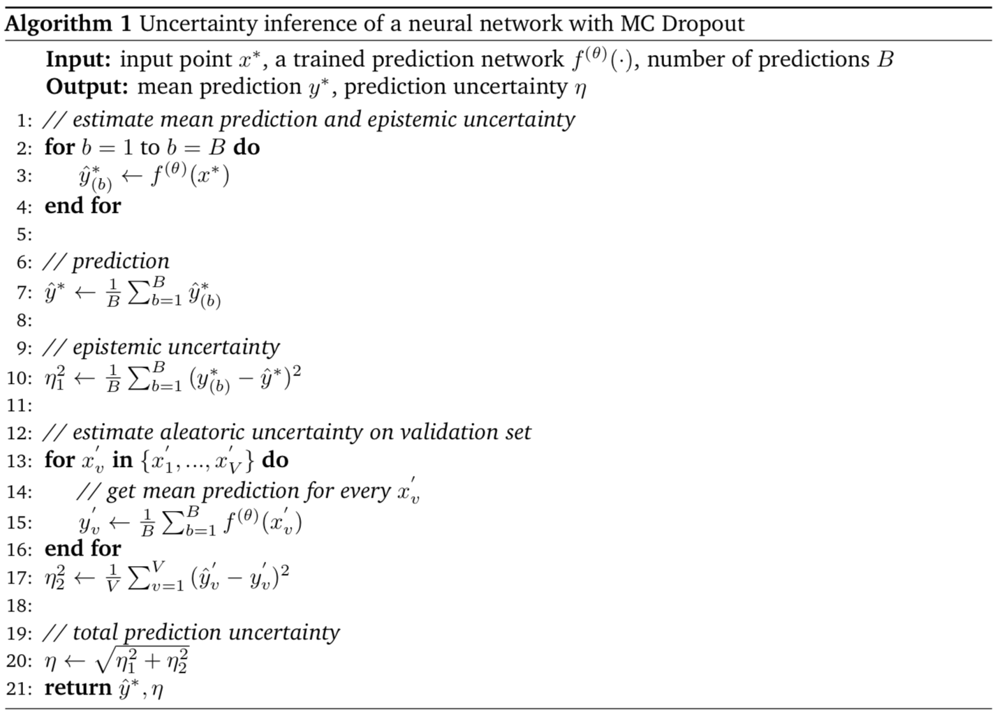
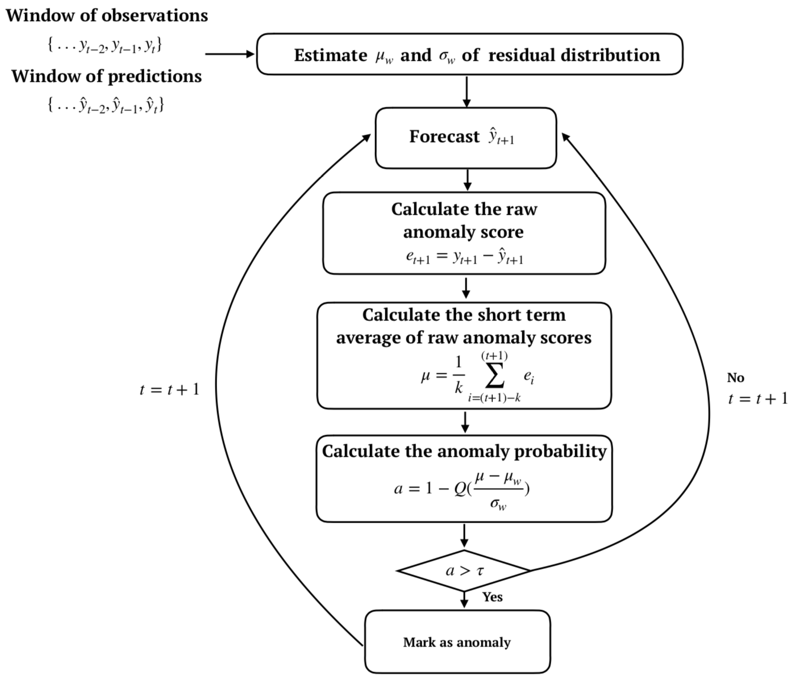

# Thesis Summary

Title: "Unsupervised Anomaly Detection on Streaming Data in the Petroleum Industry using Deep Neural Networks" 
Authors: Halvor Reiten, Thomas Kleiven

Master's thesis in Engineering and ICT at the Norwegian University of Science and Technology. The thesis proposes and demonstrates two model-based, unsupervised anomaly detection algorithms for a gas compressor operating on a oil platform in the North Sea. What follows is a highly abbreviated version of the thesis. The abstract is included in full, followed by brief summaries, highlights, and salient plots for the problem definition, the data used, the final deep learning models, the anomaly detection algorithms and results.

The complete thesis is included in the repository, along with most of the code for data preprocessing and fitting of the final models, as well as numerous plots and illustrations.

---

## Abstract

Modern petroleum production systems are intensively monitored by a high number of sensors and condition monitoring equipment, generating vast amounts of data that is continuously streamed to production data platforms. A fundamental capability of streaming analytics is to develop anomaly detection methods that can efficiently monitor critical equipment and warn about anomalous behavior, helping to prevent imminent equipment failures and reduce operational risk. As such, the main objective of this thesis is to demonstrate how to develop unsupervised, real-time anomaly detection algorithms for equipment in the oil and gas industry. We specifically look at a gas compressor operating at an oil rig in the North Sea, and propose two model-based anomaly detection methods that identify anomalies by comparing the true measurements to the predictions of a probabilistic model that simulate the normal behavior of the equipment.

An accurate predictive model is crucial to the success of such anomaly detection methods. Seeing deep learning and sequence specialized neural networks as tremendously successful in similarly complex modeling problems, this thesis focuses on researching the potential of deep learning as a modeling framework for the physical equipment. To this end, we implement deep neural networks of varying types and designs, as well as techniques to assess the predictive uncertainty of these models. In addition, a set of less advanced baselines are implemented to benchmarks their performances. We find that the best performance is achieved by an ensemble model consisting of a Long Short-Term Memory network and a feed-forward neural network, clearly outperforming the best benchmark model by 17.2%. Consequently, this model is employed in the anomaly detection algorithms.

The first of the proposed anomaly detection methods uses a static residual distribution to classify observations, while the other uses the prediction intervals of point-predictions to do the same. The quality of the methods is evaluated by examining whether their anomaly warnings conform to our expectations when applied to three arbitrarily chosen datasets with clear abnormal patterns. On this evaluation criterion, their performances are highly satisfactory and consistent with our expectations, and we find that the applied deep learning model works excellently in conjunction with the proposed anomaly detection methods. The implemented anomaly detection setups meet the high demands of a real-time streaming anomaly detection algorithm, they can process and evaluate incoming data in a fast, efficient and unsupervised manner, and show great potential to be utilized in an industrial setting.

---

## Problem summary and definition

Modern oil and gas production is subject to intense monitoring by a magnitude of sensors and condition monitoring equipment. Vast amounts of sensor data are continuously streamed to production data platforms, presenting the industry with significant opportunities and technical challenges. A fundamental capability for streaming analytics is to develop models to detect unusual, anomalous behavior in critical equipment. The streaming data often arrives with high frequency and in vast amounts, making the task of manual inspection and analysis to look for potential faults a tedious one. Meanwhile, anomalous behavior must be identified and acted upon promptly to avoid potentially costly consequences for the production and the equipment itself. It is therefore of great interest to develop semi-automatic, unsupervised procedures to automate such tasks. Not only can such models be more precise than a human resource, but they work around the clock and can function as a early warning system.

Specifically, the main objective of this thesis is to demonstrate the construction of algorithms to detect and warn for abnormal behavior in a _first stage gas compressor_ operating on an oil rig in the North Sea. The focus is on model-based anomaly detection setups, which consists of two major components: a predictive model that can simulate the _normal behavior_ of the compressor, and a method that compares the predictions of the model to the true observed measurements to classify abnormal behavior. The intuition of this setup is that the actual observed values might differ substantially from the predictions when it operates anomalous, which can be exploited to uncover novelties.

A precise predictive model is imperative for the success of such anomaly detection setups. In detail, the model should predict the _one-step-ahead_ sensor measurements of the gas discharged from the compressor - the discharge flow, temperature and pressure - given a history of sensor measurements before the compression stage, and a set of system control parameters. It is, however, an interesting question how such predictive models are best constructed. The equipment is part of a complex production system and can have hundreds to thousands of potentially relevant sensors associated with it. The sensors have interdependent relationships that can be hard to determine, and the performance of the machinery can be highly dependent on exogenous variables and the specific operational conditions. This is not easily incorporated into rigorous theoretical models or existing simulation tools. Consequently, we focus on data-driven approaches, and specifically machine learning models, without applying laws of physics or domain knowledge about the equipment. This effectively ensures that the produced models are as generic as possible, making it easy to extend them to other types of equipment. Recently, _deep learning_, a subfield of machine learning, has become increasingly popular due to its general-purpose assumptions and automatic feature engineering. Sequence specialized networks, such as the Long Short-Term Memory network, has seen tremendous success in similarly complex and high-dimensional time series modeling problems, and can presumably tackle the complexities of modeling physical equipment as well. However, while deep learning can achieve remarkable accuracy, the models are commonly criticized for their "black box" characteristics. Seeing the _predictive confidence_ as critical if the models are to be of practical value for decision-support and anomaly detection, there is a need to assess the uncertainty of the deep learning models. As such, this thesis is mainly focused with deep learning as a modeling framework for the equipment, and researching techniques to assess the predictive uncertainty of the models.

With the predictive models and uncertainty assessment techniques in place, the second part of a model-based anomaly detection algorithm is a logic that compares the predicted values to the true observed measurements to classify novelties. A major part of this thesis is concerned with _how_ and _when_ the algorithm should alert for anomalous behavior.

---

## Data

The data used in this thesis originates from a gas compressor operating on an oil platform in the North Sea, made available by Cognite and AkerBP in the [Open Industrial Data project](https://openindustrialdata.com/) through a public API. The dataset consists of hundreds of sensor data sources, maintenance logs, P&ID diagrams and production data for the entire lifetime of the equipment (approximately from 2013 to present).

### Model inputs and outputs

In total, there are more than 350 numerical time series for the subsystem of the compressor that are available. They can effectively be separated into three main categories:

- **Input sensors**: Sensors placed exclusively upstream of the compressor. Sampled every second.
- **Controls**: Control parameters of the system, such as engine running speed, valve openings and power supplied to the compressor. Typically 2 - 60 measurements per minute.
- **Output sensors**: Sensors placed directly downstream of the compressor, measuring the physical parameters of the compressed gas (mass flow, temperature and pressure). Sampled every second.

The inputs to the model are a combination of input sensors and controls, while the outputs are the output sensors. For the sake of brevity, the process of selecting model inputs and outputs are not described here, but we perform a variety of feature selection techniques that results in a dataset containing 6 inputs and 3 outputs, shown in the figure below (blue circles are the tags used as model outputs). The interested reader is referred to the thesis for further details.

<i>Tags selected as inputs (red and green) and outputs (blue) for the predictive model.</i>

While the sampling rate of most of the selected sensors is on second-basis, implying 60 recordings per minute, we aggregate the measurements to one sample per minute by taking the average. We extract a two month window where the data looks continuosly normal (not interrupted by seemingly anomalous sequences), from 24th of December 2017 to the 24th of February 2018. This results in a dataset of 88685 observations of the 9 features. The dataset is split into a training set (60% of the data), a validation set (20%) and a test set (20%). Since we aim to build models that capture the temporal structure, we simply split this into three continuous intervals. This is shown in the figure below.

All other preprocessing steps are described further in the thesis.

---

## Constructing the predictive model

The deep learning models are implemented in Keras using the TensorFlow backend, and run on a 6-core, 3.2GHz Intel i7-8700 CPU.

### Benchmark models

In order to properly evaluate the quality of the more complex deep learning models, we implement less advanced behcnmark models. They effectively serve as a sanity check that the deep neural networks have to outperform in order to demonstrate usefulness. We develop benchmarks of two categories, namely _common-sense heuristics_ and _simpler machine learning techniques_ by linear models and tree-based methods. The common-sense heuristics reflect how well the compressor can be modeled without actually building a model, and incldue predicting _the previous value_, _the mean value_ and a _moving average_. The linear models comprise ordinary least squares linear regression and shrinkage methods (Ridge, LASSO and ElNet). To account for possible non-linear relationships in the data, we implement two tree-based methods; Random Forest (RF) and Gradient Boosting Machines (GBM).

### Deep learning

We mainly explore three types of deep learning networks: A feed-forward neural network, a Long Short-Term Memory network and a Gated Recurrent Unit network. In addition, we explore ensemble models of these to research the potential gains of this. Our experimentation resulted in tenfolds of candidate architectures evaluated on the validation set, but only the most promising are included in the thesis. The sequential networks use a window size of 360 observations (the past 6 hours of data) to make a prediction, while the feed-forward neural network is trained to map the inputs at time _t_ to the outputs at time _t+1_.

Some design choices were common for all implementations:

- **Error metric**: MAE.
- **Optimizer**: ADAM.
- **Learning rate**: 0.001, scheduled to be halved when training loss isn't improved in 5 or more iterations.
- **Batch size**: 256.
- **Epochs**: 50.
- **Regularization**: Heavy use of time-constant and recurrent dropout, where relevant. Dropout is applied both in the training phase and the prediction phase.
- **Lookback/Window size** (where relevant): 360 observations, or 6 hours of prior data.
- **Activation functions**: ReLU

For each of our final architectures we use the minimum validation loss (MVL) method to extract the best weights and evaluate the resulting performance. The final LSTM network consists of a single hidden layer with 128 nodes, and same with the GRU network. The final feed-forward network consists of a single hidden layer with 1024 nodes. The ensemble model combine the predictions of the LSTM network and the feed-forward neural network through a linear regression model, illustrated in the figure below.

_Illustration of the LSTM/MLP ensemble._

### Uncertainty assessment

The implemented neural networks are stochastic models as they apply dropout in every layer in the prediction phase (in addition to the training phase). Each prediction of the model can be seen as a stochastic realization of the predictive distribution. For any input to a model, we are interested in the predictive mean, μ, and the predictive uncertainty, η. The point-wise predictive uncertainty can be decomposed into two components:

1. The aleatoric uncertainty, which is the inherent noise in the data
2. The epistemic uncertainty, capturing our ignorance with regards to the specification of model parameters. Often referred to as _model uncertainty_.

The aleatoric uncertainty is estimated by evaluating the residual sum of squeares of the model on the validation set. The epistemic uncertainty is estimated by evaluating the variance of _B_ predictions for an input point _x_, assuming a Gaussian distribution. The pseudocode below illustrates this.

---

## Anomaly detection

### Residual based anomaly detection

This method identifies anomalies based on a comparison between the residual and a static residual distribution built on the validation set. For a new observation, a smoothed residual of the past _m_ residuals is calculated, and an anomaly score is computed by the tail probability that the smoothed residual comes from the residual distribution. Point anomalies are classified when the anomaly score is greater than a specified threshold.

_Schematic of the residual based anomaly detection method_

### Prediction interval-based anomaly detection

This approach exploits the fact that the predictive models are probabilistic, and utilizes the pointwise predictive distributions of the models to identify anomalies. A new observation is classified based on whether it is within the bounds of the 99%-confidence interval of the model.

_Schematic of the prediction interval-based anomaly detection method_

### Evaluation

As the dataset lacks labeled regions of anomalies, and we had limited access to experts, the models were evaluated based on a more intuitive approach. The methods are demonstrated on hand-picked datasets that exhibit clear abnormal patterns, and we assess the quality of the methods based on whether they can identify the unusual patterns. Thus, the effectiveness of the methods are based on subjective expectations to where any good anomaly detection algorithm would classify abnormal behaviour.

---

## Results

### The predictive model

We use the Mean Absolute Error as the loss function, and this metric is supplied for each model for each target. The overall performance is the average MAE across all targets on the test set. Only the best deep learning model compared to the best benchmarks for each respective target is supplied in this brief summary. For full results, please refer to the thesis.

We found the best overall model to be the ensemble model, denoted _LSTM/MLP_, combining the predictions of the LSTM and MLP through a linear regression model. This model is compared to the best benchmark for each target in the table below

| Target      | Best benchmark (BM)        | BM MAE | LSTM/MLP MAE | Improvement |
| :---------- | :------------------------- | :----: | :----------: | :---------: |
| Flow        | GBM                        | 0.590  |    0.512     |    13.2%    |
| Temperature | Predict Previous Heuristic | 0.183  |    0.226     |   -23.7%    |
| Pressure    | ElNet Regression           | 0.491  |    0.386     |    21.3%    |
| Overall     | OLS Linear Regression      | 0.453  |    0.375     |    17.2%    |

We see a 17.2% relative improvement of the ensemble model compared to the overall best benchmark. The below figure shows the uncertainty of the LSTM/MLP in practice, where the gray lines represent stochastic realizations of the model.

### Anomaly detection

We apply both proposed anomaly detection methods to three hand-picked datasets, but we only present the results of one of these on one dataset in this brief summary. The figure below demonstrates the residual based method on a dataset in April 2017 for the discharge temperature.

Both for this example and for the other datasets, we find that the performance of the anomaly detection methods are highly satisfactory in the sense that they classify anomalies where we expect them to. The deep learning model works excellently in conjunction with the proposed methods, where it is highly accurate when the data is seemingly normal, but inaccurate otherwise.

For in-depth discussions on the results, please refer to the thesis.
